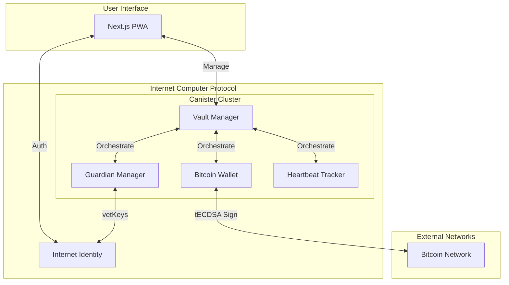
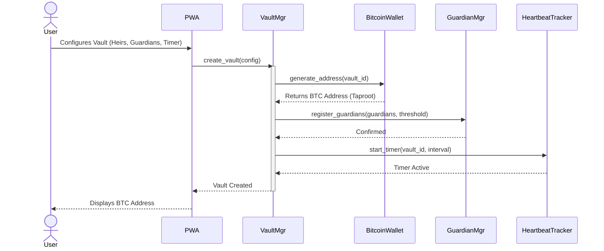
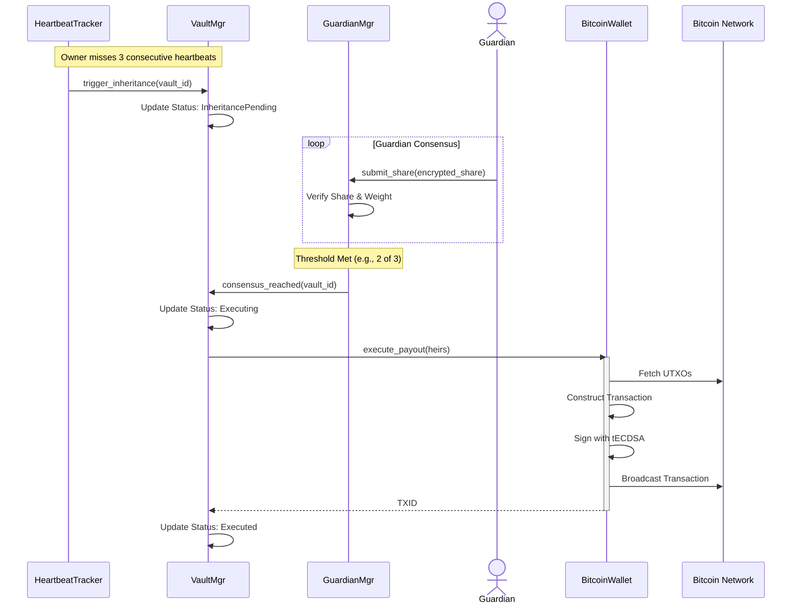

# ThresholdVault

> **Trustless. Autonomous. Bitcoin Inheritance.**
>
> *The first protocol to solve the "Lost Bitcoin" crisis using Threshold ECDSA and Canister Timers on the Internet Computer.*

---

## 📖 Overview

**ThresholdVault** is a decentralized protocol that enables Bitcoin holders to create autonomous "dead man's switches" for their assets. Unlike traditional multi-sig or legal solutions, ThresholdVault relies on **cryptographic guarantees** rather than human intermediaries.

By leveraging the Internet Computer's **Threshold ECDSA (tECDSA)** and **Canister Timers**, the protocol ensures that your Bitcoin remains in your sole custody while you are alive, and automatically transfers to your designated heirs if you fail to prove your life (heartbeat) for a pre-defined period.

### Core Value Proposition
*   **Non-Custodial:** You hold the keys (via tECDSA). The protocol cannot spend without your authorization or the inheritance trigger.
*   **Autonomous:** No lawyers, no probate courts, no manual intervention required.
*   **Privacy-Preserving:** Guardian identities and heir details are encrypted using **vetKeys**.
*   **Bitcoin Native:** Works directly with the Bitcoin network (no wrapped tokens, no bridges).

---

## 🏗 System Architecture

ThresholdVault operates as a suite of four interacting canisters, forming a secure state machine.

### Component Responsibilities

| Component | Technology | Responsibility |
| :--- | :--- | :--- |
| **Vault Manager** (`vault_mgr`) | Motoko | The central orchestrator. Manages vault state, configuration, and inter-canister calls. |
| **Bitcoin Wallet** (`bitcoin_wallet`) | Rust | Handles **tECDSA** key derivation, address generation, UTXO management, and transaction signing. |
| **Guardian Manager** (`guardian_mgr`) | Rust | Manages guardian identities, encrypted shares (**vetKeys**), and threshold voting logic. |
| **Heartbeat Tracker** (`heartbeat_tracker`) | Motoko | A dedicated timekeeper that monitors proof-of-life signals and triggers inheritance protocols. |

---

## 🔄 Critical User Flows

### 1. Vault Creation & Initialization
The setup process establishes the cryptographic foundation for the vault.

### 2. The "Dead Man's Switch" (Inheritance Execution)
This flow executes automatically when the owner fails to provide a heartbeat, and the guardian threshold is met.

---

## 🔐 Security Model

### Threshold ECDSA (tECDSA)
Instead of a single private key stored in one location, the private key is mathematically split across nodes in the ICP subnet.
*   **Key Generation:** Distributed Key Generation (DKG) ensures the full key never exists in memory.
*   **Signing:** Requires consensus from $\ge 2/3$ of the subnet nodes to produce a valid signature.

### vetKeys (Verifiable Encrypted Threshold Keys)
Used for the Guardian Network.
*   Guardian shares are encrypted such that they can only be decrypted by the specific guardian's principal ID.
*   Prevents the canister controller or malicious nodes from reading guardian shares.

### Canister Security
*   **Controller Lock:** The `VaultMgr` is the *only* principal authorized to call sensitive methods on `BitcoinWallet` and `GuardianMgr`.
*   **Timer Integrity:** `HeartbeatTracker` runs on system-level timers, immune to frontend censorship.

---

## 🛠 Technology Stack

*   **Frontend:** Next.js 14, Tailwind CSS, TypeScript, PWA
*   **Backend (Canisters):**
    *   **Rust:** For high-performance cryptographic operations (`bitcoin_wallet`, `guardian_mgr`).
    *   **Motoko:** For state machine logic and actor orchestration (`vault_mgr`, `heartbeat_tracker`).
*   **Infrastructure:** DFX (SDK), Internet Computer Mainnet.
*   **Integrations:** Internet Identity, Bitcoin Network (Testnet/Mainnet).

---

## 📜 License

This project is licensed under the MIT License.

